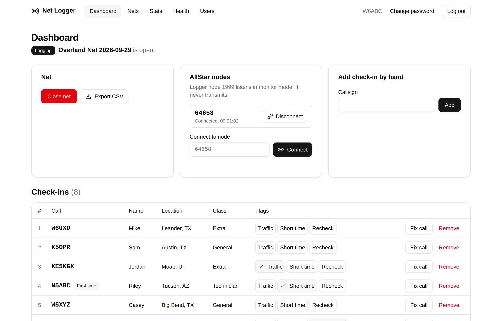

# Net Logger

[](https://github.com/InnerSpark/netlogger/actions/workflows/ci.yml) [](LICENSE)

**A free, self-hosted check-in logger for AllStar ham radio nets.**

Net Logger listens to your AllStar node, turns each transmission into text, and builds the net roster for you: callsigns, names, license class, traffic and short-time flags, rechecks, and first-time check-ins. Net control watches it live in a browser on a laptop or phone.

**It is receive-only.** It links in monitor mode and never transmits, so it adds nothing to the air.



## What it does

- **Live roster:** check-ins appear as stations call in, in order, with name and class from callook.info.
- **Flags from speech:** "with traffic", "short time", "call me back" are picked up and flagged.
- **Recheck list:** who asked to be called back and hasn't been.
- **First-timer tag:** calls never logged before, so net control can welcome them.
- **Node control:** connect the logger to any AllStar node and disconnect it from the dashboard.
- **Accounts:** an admin plus as many net control operators as you need.
- **CSV export** after the net.
- **Works on a phone:** big tap targets, light and dark mode, screen reader friendly.

## How it works

```
Your AllStar node ──link──> Logger's private node (1999) ──USRP audio──> Net Logger
                                                                            │
Net control's browser ─────────────────────────────────────────> dashboard :8080
```

1. A **private node** on your AllStar server links to the net's node in monitor mode.
2. It streams audio to Net Logger over **USRP** (UDP).
3. Net Logger splits it into transmissions, transcribes each one with **Whisper** (runs locally, no cloud), and pulls out callsigns.
4. The dashboard updates every two seconds.

## Two ways to install

**A. On your AllStar server (recommended).** If you run your own ASL3 node, install Net Logger right on it. One script sets up the logger node and node control **without touching your existing node settings**, and the logger can link to **any public node** through your server. See **[docs/same-server.md](docs/same-server.md)**.

```
cd /opt && sudo git clone https://github.com/InnerSpark/netlogger.git
cd netlogger && sudo ./install.sh
```

**B. On another computer with Docker.** A Mac, Linux box, or Pi that gets audio from your AllStar server over the network. See the quick start below and **[docs/allstar-setup.md](docs/allstar-setup.md)**.

Either way you need an **AllStar node you control**. Anyone licensed can get a node number free from AllStarLink.

### Requirements

- **Speech to text needs CPU:** 2+ cores and 2 GB free RAM for `base.en`, 4 cores and 4 GB for `small.en`. Apple Silicon Macs and modern x86 boxes handle `small.en` easily.
- **Option A:** Debian with ASL3.
- **Option B:** Docker (Docker Engine, Docker Desktop, or OrbStack on a Mac), and a network path from the AllStar server to the logger (same LAN, or a VPN like Tailscale).

## Quick start with Docker (option B)

1. **Get the code and settings file:**
   ```
   git clone https://github.com/InnerSpark/netlogger.git
   cd netlogger
   cp .env.example .env
   ```
2. **Edit `.env`.** For node control, fill in the `AMI_*` settings. Everything is explained in the file.
3. **Start it:**
   ```
   docker compose up -d --build
   ```
   The first start downloads the Whisper model (about 500 MB for `small.en`).
4. **Open `http://<this-computer>:8080`** and create the admin account.
5. **Follow the Setup page.** After you create the admin account, the app opens a **Setup** page with a live status checklist and step-by-step AllStar instructions, with your node number, ports, and addresses already filled in and a Copy button on every snippet. The same steps are in [docs/allstar-setup.md](docs/allstar-setup.md).

Useful commands:

```
docker compose logs -f     # watch what it hears
docker compose restart     # restart it
docker compose down        # stop it
```

## Running a net

1. Enter the net name and click **Open net**. Nothing is logged until a net is open.
2. Under **AllStar nodes**, connect to the net's node if it isn't already.
3. Check-ins appear as stations call in. **First time** marks new calls. **Not found** means the call didn't validate: use **Fix call**.
4. Flags set themselves from what's said. Click to change them.
5. **Add check-in by hand** for anything missed.
6. **Close net**, then **Export CSV**.

## Accounts

- The first person to open the dashboard creates the **admin** account.
- Admins add users on the **Users** page. **Operators** run nets and connect nodes. **Admins** also manage users.
- Passwords are at least 10 characters and stored as scrypt hashes. Changing or resetting a password logs that account out everywhere else.
- Five wrong passwords in a row from one address slows further tries down.

## Security

- **Only put the dashboard on the internet behind HTTPS.** The installer sets this up for a subdomain (see [docs/same-server.md](docs/same-server.md)). With Docker, keep it on your LAN or VPN, or put it behind a reverse proxy with HTTPS and set `COOKIE_SECURE=1` and `TRUST_PROXY=1`.
- The AMI account only needs `command` rights. Limit it to the logger's address in `manager.conf`.
- Report security issues privately: see [SECURITY.md](SECURITY.md).

## Settings

All settings live in `.env`. See [.env.example](.env.example) for the full list with notes. Change a setting, then run `docker compose up -d`.

## Testing without a live net

Replay a recording of a past net as if it came from the node. Open a net in the dashboard first.

```
docker compose cp old_net.wav netlogger:/tmp/old_net.wav
docker compose exec netlogger python3 tools/replay.py /tmp/old_net.wav
```

It splits the audio at pauses and sends each piece like a real transmission. Any format ffmpeg reads works.

## Troubleshooting

**Nothing shows in Last heard**

Start with the **Setup** page in the app. Its status checklist shows whether audio is arriving and whether node control can reach your server.

1. Logs: `journalctl -u netlogger -f` (installer) or `docker compose logs -f` (Docker). Do you see `[2.3s] ...` lines when someone keys up?
2. Is the logger node linked? Check the **AllStar nodes** card, or on the AllStar server run `sudo asterisk -rx "rpt lstats 1999"`.
3. Can the AllStar server reach this computer on UDP 34001? Check firewalls and your VPN.

**Heard, but no check-ins:** is a net open?

**Calls come out wrong**
- Read the raw text in **Last heard**. If Whisper heard it right but the call is wrong, it's a parser bug: please open an issue with the line.
- If Whisper heard it wrong, try a bigger model (`small.en`, then `medium.en`), and list your regulars in `KNOWN_CALLS`.
- To tune on real audio: set `SAVE_AUDIO=50`, let it hear some transmissions, then run `tools/tune.py base.en small.en` to compare models side by side.

**Names and class are blank:** callook.info is unreachable, or the call isn't a US call. Check-ins still log. **Fix call** with the same call retries the lookup.

**Node control says it can't reach the server:** check `AMI_HOST`, that port 5038 is open to this computer, and the `permit` line in `manager.conf`.

## Known limits

- **US callsigns only** for now (parser and lookup). Other countries are welcome as a contribution.
- The **first** callsign in a transmission is logged as the check-in. If net control reads out a new call, remove the extra row.
- Weak signals and doubles need a manual fix.
- If the internet between the AllStar server and the logger drops, logging stops. The net itself keeps running.

## Development

See [CONTRIBUTING.md](CONTRIBUTING.md) for running it locally, tests, and the code layout.

## License

**AGPL-3.0.** Free to use, change, and share. If you run a modified version for other people to use over a network, you must share your changes under the same license. See [LICENSE](LICENSE).

Net Logger is not affiliated with AllStarLink, Inc. Operators are responsible for following their country's amateur radio rules.
